<div align="center" markdown="1">
   <sup>Special thanks to:</sup>
   <br>
   <br>
   <a href="https://www.warp.dev/mcat">
      
   </a>

### [Warp, the intelligent terminal for developers](https://www.warp.dev/mcat)
[Available for MacOS, Linux, & Windows](https://www.warp.dev/mcat)<br>

</div>
<hr>

<div align="center">
  


# Mcat
   

[Installation](#%EF%B8%8F-installation) • [Examples](#%EF%B8%8F-example-usage) • [CHANGELOG](./CHANGELOG.md)


</div>

## ✨ Features
* 📄 **File to Markdown/HTML**  
  Convert structured content like CSVs, directories, and rich document formats (e.g., DOCX) into clean Markdown/HTML.
  
* 🏞️ **Markdown/HTML to Image**  
  Render Markdown or HTML files into images.
  
* 🖼️ **Inline Image/Videos**  
  Display images/videos *inside* your terminal using protocols like Kitty, iTerm, or Sixel (with tmux support!).
  
* 🌐 **Handles URLs and Stdin too!**  
  You don't have to save things locally in your PC to use mcat!

* 🔗 **Concatenate Images and Video too!**  
  Concatenate videos of the same format (time concat)
  and Concatenate images by stacking them horizontal or vertical(default)
  
* 💃🏻 **Style-able**  
  Contains different themes to fit your taste

## ⬇️ Installation
```sh
cargo install mcat
```
or ~
```sh
git clone https://github.com/Skardyy/mcat
cd mcat
cargo install --path ./crates/core
```
or prebuilt from the [latest release](https://github.com/Skardyy/mcat/releases/latest)

## ⚙️ Supported Pipeline

```mermaid
flowchart TD
    %% Input sources (grouped)
    INPUT[📁 Input Sources<br/>Local Files, stdin, URL]
    
    %% Various file formats (grouped)
    DOCS[📄 Documents<br/>DOCX, PDF, ODT...]
    CODE[💻 Code<br/>Rust, Go, Python...]
    DATA[📊 Data<br/>CSV, JSON, XML...]
    MEDIA[🎬 Media<br/>Images, Videos]
    
    %% Core processing formats
    MD[📝 Markdown]
    HTML[🌐 HTML]
    
    %% Output options
    TERM[💻 Pretty Terminal]
    IMAGE[🖼️ Static Image]
    INTERACTIVE[⚡ Interactive Images]
    INLINE_DISPLAY[👁️ Inline Display<br/>Images & Videos]
    
    %% Input to file types
    INPUT --> DOCS
    INPUT --> CODE
    INPUT --> DATA
    INPUT --> MEDIA
    
    %% Main processing pipeline
    DOCS --> MD
    CODE --> MD
    DATA --> MD
    
    MD --> HTML
    MD --> TERM
    
    HTML --> IMAGE
    
    %% Image output paths
    IMAGE --> INTERACTIVE
    IMAGE --> INLINE_DISPLAY
    
    %% Media direct paths
    MEDIA --> INTERACTIVE
    MEDIA --> INLINE_DISPLAY
    
    %% Styling
    classDef inputSource fill:#e1f5fe,stroke:#01579b,stroke-width:2px,color:#000
    classDef fileFormat fill:#fff3e0,stroke:#e65100,stroke-width:2px,color:#000
    classDef coreFormat fill:#f3e5f5,stroke:#4a148c,stroke-width:2px,color:#000
    classDef outputFormat fill:#e8f5e8,stroke:#1b5e20,stroke-width:2px,color:#000
    
    class INPUT inputSource
    class DOCS,CODE,DATA,MEDIA fileFormat
    class MD,HTML coreFormat
    class TERM,IMAGE,INTERACTIVE,INLINE_DISPLAY outputFormat
```


## 🏋️ Example Usage
```sh
# View a document at the terminal
mcat resume.pdf

# Or from a url!
mcat "https://somewebite.com/file.pdf"

# Need it as HTML?
mcat project.docx -o html

# list a directory using images!
mcat ls

# Show a document inline as an image
mcat readme.md -i

# Or HTML!
mcat index.html -i

# Just save?
mcat index.html -o image > page.png

# Too big? zoom and pan it inside the terminal!
mcat file1.js file2.js file3.js file4.js -o interactive
mcat bigimg.png -o interactive

# Show a document as an image inline with a different theme
mcat main.rs another.rs -it monokai

# Show media inline in your terminal
mcat diagram.png
mcat video.mp4

# From a url
mcat "https://giphy.com/gifs/..."

# Images too!
mcat "https://website/images/..."

# From stdin?
mcat < somefile.png

# Concatenate documents and turn them into an image
mcat document.docx presentation.odt table.xlsx archive.zip -o image > all.png

# Or just select interactively and copy to clipboard (for ai prompts)
# Replace scb with a command from your os
mcat directory | scb

# Concatenate images (stacks vertical)
mcat someimage.png anotherimage.bmp

# Or save it (stacks horizontal)
mcat someimage.png anotherimage.bmp --hori -o image > save.png

# Concatenate videos (must be same format: codec,audio..)
mcat part1.mp4 anothervideo.mp4 -o video > save.mp4
```

## 🛐 Dependencies
Mcat tries to have as little dependencies as possible.
#### chromium (for rendering HTML to image):
1. exists on every windows machine through msedge. and other machines that have chrome/msedge/chromium
2. can be installed by doing `mcat --fetch-chromium`
#### ffmpeg (for videos)
1. if your machine has it 🫠.
2. can be installed by doing `mcat --fetch-ffmpeg`

## 🆘 Help
```txt
mcat --help
Usage: mcat [OPTIONS] [input]...

Arguments:
  [input]...  file / dir / url

Options:
  -o, --output <output>                  the format to output [possible values: html, md, image, video, inline, interactive]
  -t, --theme <theme>                    the theme to use [default: dark] [possible values: dark, light, catppuccin, nord, monokai, dracula, gruvbox, one_dark, solarized, tokyo_night]
  -s, --style-html                       add style to html too (when html is the output)
  -a, --hidden                           include hidden files
      --kitty                            makes the inline image encoded to kitty
      --iterm                            makes the inline image encoded to iterm
      --sixel                            makes the inline image encoded to sixel
      --ascii                            makes the inline image encoded to ascii
  -i                                     shortcut for putting --output inline
      --hori                             concat images horizontal instead of vertical
      --opts <inline-options>            options for the --output inline
                                         *  center=<bool>
                                         *  width=<string> [only for images]
                                         *  height=<string> [only for images]
                                         *  scale=<f32>
                                         *  spx=<string>
                                         *  sc=<string>
                                         *  inline=<bool>
                                         *  zoom=<usize> [only for images]
                                         *  x=<int> [only for images]
                                         *  y=<int> [only for images]
                                         *  exmp: --inline-options 'center=false,width=80%,height=20c,inline=true,scale=0.5,spx=1920x1080,sc=100x20,zoom=2,x=16,y=8'
      --delete-images                    deletes all the images, even ones that are not in the scrollview.. currently only works in kitty
      --report                           reports image / video dimensions when drawing images. along with reporting more info when not drawing images
      --silent                           removes loading bars
      --fetch-chromium                   download and prepare chromium
      --fetch-ffmpeg                     download and prepare ffmpeg
      --fetch-clean                      Clean up the local binaries
      --generate <generate-completions>  Generate shell completions [possible values: bash, zsh, fish, powershell]
  -h, --help                             Print help
  -V, --version                          Print version
```

## 🚧 Roadmap
- [ ] mcat.nvim: a neovim plugin to use mcat inside neovim

## 📎 License
MIT License
